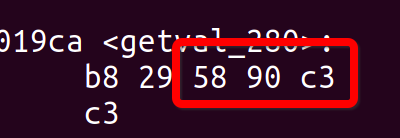
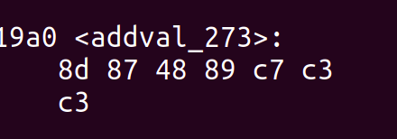

### Phase1

这一部分主要是考察覆盖返回地址导致的异常情况。通过观察返回地址的位置，以及当前栈指针的位置，还要希望跳转到的函数的地址。

就可以实现目标。还有注意是小端模式。

### Phase2

这一部分主要考察如何向可执行文件中注入代码。这里使用的方式是，将注入的代码放到栈中，然后覆盖原本的返回地址，将其修改为栈中的某个地址，然后

就可以跳转到注入的代码中执行。在注入的代码中完成对特定寄存器的赋值之后，再将`touch2`的地址压入栈中，并采用`ret`指令，跳转到`touch2`中执行！

- 先将自己想要注入的代码的汇编用`gcc`汇编成机器码，然后再放到输入文件中
- 想清楚大小端

### Phase3

这一部分和Phase2类似，只不过这里需要比较两个字符串，将字符串存到栈低，然后跳转到`touch3`即可。其它操作类似，将字符串的首地址放到对应的寄存器即可，同样把注入代码放到栈顶！

### Phase4

如果操作系统对固定的段增加了一定的权限，比如栈不能执行，那么上面在栈上注入代码的方式就会失效。

这个时候可以利用代码本身的一些指令，凑出我们想要的执行流，通过对栈进行改写！（太强了）

通过提示，在汇编中发现了如下的序列。





其实大致的思路是这样的：

1. 因为要传递参数，所以一定会最后将一个数放到%rdi中，这有这样几种方式：

   - 从一个寄存器搬过去
   - 从栈顶弹出来

   然后查表对应的指令前缀，搜索就可以找到了！

这样就可以构造出如下的执行流：

```assembly
popq %rax
movq %rax %rdi
retq
```

然后将栈构造出来，填上数据和地址即可。

### Phase5


